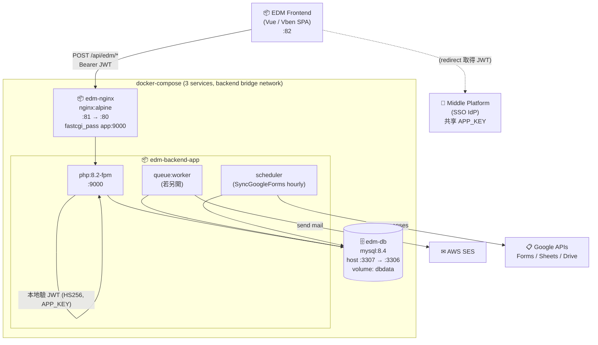
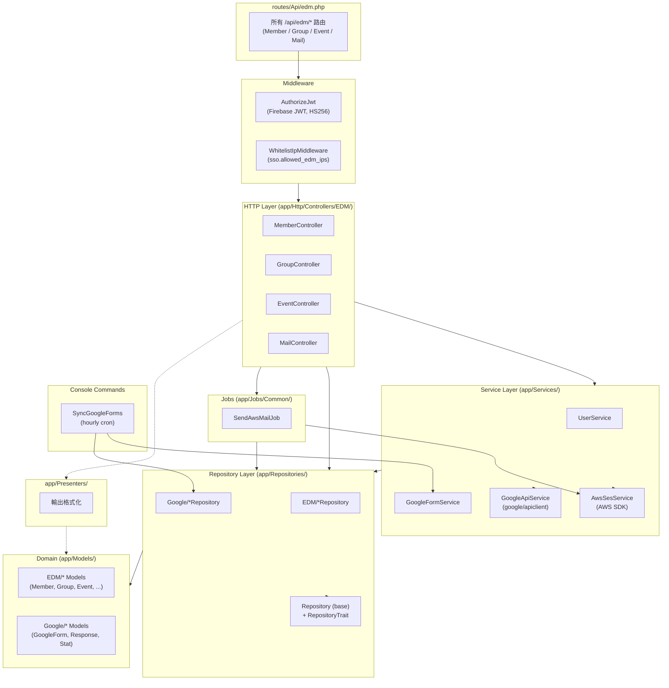
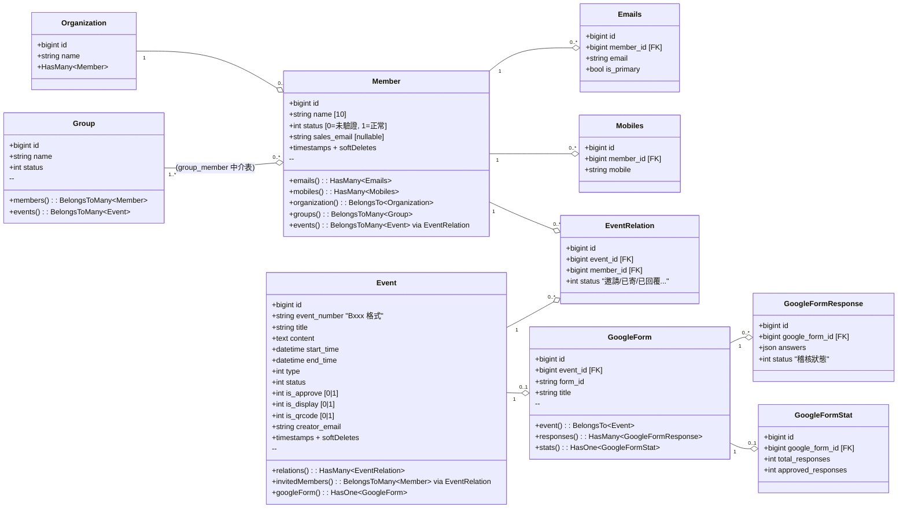
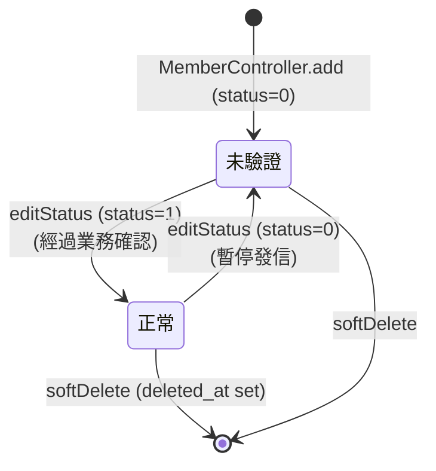
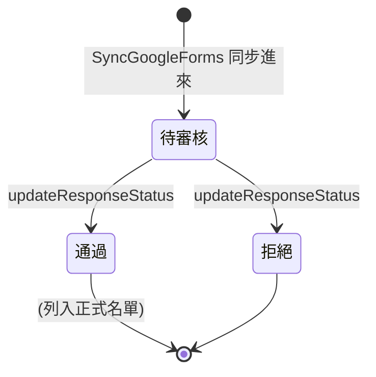

# Architecture

本文件描述 EDM Backend 的程式分層、模組組成、與外部整合介面。採 C4 Model 的 Container / Component 兩層 + Class Diagram。

目標讀者:**開發者、Architect、想理解內部結構的 Reviewer**。

---

## Level 1 — System Context

「這個系統服務誰、又依賴誰?」見 [`overview.md` 第 2 節](./overview.md#2-在生態裡的位置)。

---

## Level 2 — Container Diagram

「把系統打開來看,裡面有哪些獨立部署單元?」

**容器清單**

| 容器 | 角色 | Host Port | Container Port |
|---|---|---|---|
| `edm-nginx` | 反向代理、TLS 終止點 | **81** | 80 |
| `edm-backend-app` | Laravel App (PHP-FPM) | — | 9000 |
| `edm-db` | MySQL 8.4 | **3307**(僅本機 DB IDE 用) | 3306 |

> **Port 設計**:Laravel 容器內透過 `db:3306` 連 DB(同網段),host 上 `3307` 純粹避免跟 host 既有的 3306 撞。詳見 [`deployment.md`](./deployment.md)。

---

## Level 3 — Component Diagram(Laravel App 內部分層)

「app 容器裡面,程式碼是怎麼分層的?」

**分層職責**

| 層 | 資料夾 | 該做什麼 | 不該做什麼 |
|---|---|---|---|
| **Routes** | `routes/Api/edm.php` | 對映 path → controller method | 任何商業邏輯 |
| **Middleware** | `app/Http/Middleware/` | 橫切關注點(JWT 驗證、IP 白名單) | 商業邏輯、DB 寫入 |
| **Controllers** | `app/Http/Controllers/EDM/` | 接 request → 呼叫 service / repo → 回 response | 直接寫 SQL、跨 service 編排業務 |
| **Services** | `app/Services/` | 跨 entity 的業務邏輯、外部 API 呼叫(SES、Google) | 封裝單表 CRUD |
| **Repositories** | `app/Repositories/` | 單表 CRUD + 複雜查詢 | 業務規則(屬於 service) |
| **Models** | `app/Models/` | Eloquent + relations + casts + accessor | 跨 entity 的業務邏輯 |
| **Jobs** | `app/Jobs/Common/` | 重副作用、可重試的非同步任務 | 同步資料返回 |
| **Console Commands** | `app/Console/Commands/` | 排程任務(`Schedule::command()`) | HTTP 處理 |
| **Presenters** | `app/Presenters/` | 統一的輸出資料格式 | DB 操作 |

> **為何用 Repository Pattern?** Laravel 不強制 — 但本專案有「單元測試需要 mock data layer」與「同一張表常被多 controller 查」兩個需求,所以拉出 Repository 集中查詢邏輯。`Repository` 基底類別 + `RepositoryTrait` 提供共用方法(分頁、軟刪除過濾)。

---

## Level 4 — Class Diagram(核心 Domain Model 關聯)

「主要業務 entity 之間的關係」

**設計重點**

- **Member 拆 Email / Mobile 為獨立表**:一個會員可有多組聯絡方式;寄信時 join `emails` 取主要 email
- **Group ↔ Member 用中介表**:Eloquent `BelongsToMany`,加入時間 / 加入者可記在 pivot
- **Event ↔ Member 透過 EventRelation**:不直接 ManyToMany,因為 EventRelation 自己有 `status` 等業務欄位(不只是關聯,本身是 entity)
- **GoogleForm 為 1:1 綁 Event**:每場活動最多一張表單;表單回應透過 cron 同步入庫,不即時拉
- **所有業務 entity 用 SoftDelete**:詳見 [adr/0003-soft-deletes.md](./adr/0003-soft-deletes.md)

> 對應 DB 視角的詳述請見 [`data-model.md`](./data-model.md)。

---

## Level 5 — State Diagram(關鍵 Entity 生命週期)

幾個有 `status` 欄位的 entity 都有狀態機概念。最重要的兩個:

### 5.1 Member.status

### 5.2 GoogleFormResponse.status(回應審核流)

> Event 也有 `status` / `is_approve` / `is_display` / `is_qrcode` 四個狀態旗標,但設計上是「**獨立旗標而非單一狀態機**」(可同時 approve + display + qrcode),所以不畫 state machine。若未來合併成單一 enum,再補狀態圖。

---

## 6. 跨系統互動(摘要)

完整 sequence 見 [`sequence-diagrams.md`](./sequence-diagrams.md)。簡述:

| 互動場景 | 對手 | 介面 |
|---|---|---|
| 收到前端請求 | EDM Frontend | HTTPS POST `/api/edm/*` + Bearer JWT |
| 驗證 JWT | (本地) | `firebase/php-jwt` 用 `APP_KEY` 解碼 |
| 寄活動邀請信 | AWS SES | `AwsSesService` (AWS SDK) |
| 同步 Google Form 回應 | Google APIs | `GoogleApiService` + `GoogleFormService`,每小時 cron |
| 健康檢查 | Ops / LB | `GET /up`(Laravel 內建) |

---

## 7. Roadmap / 已知架構限制

| 項目 | 現況 | 下一步 |
|---|---|---|
| JWT middleware | 在 `routes/Api/edm.php` 被註解掉 | 正式環境必須開啟 |
| Queue Worker | 未在 compose 預設 | 加 `worker` service,用同 image,`command: php artisan queue:work` |
| 觀測性 | Telescope 適合 dev,不適合 prod | 加 Sentry / OpenTelemetry export 到 prod |
| 測試 | PHPUnit 框架在,需補 controller / repo 測試 | 對 Member / Event 主流程加 feature test |
| Cache | DB driver(預設) | 高負載時切 Redis |
| Auth 升級 | HS256 共享密鑰 | 待中台升 RS256 + JWKS,本系統改用公鑰驗(去除 secret 共享風險) |
