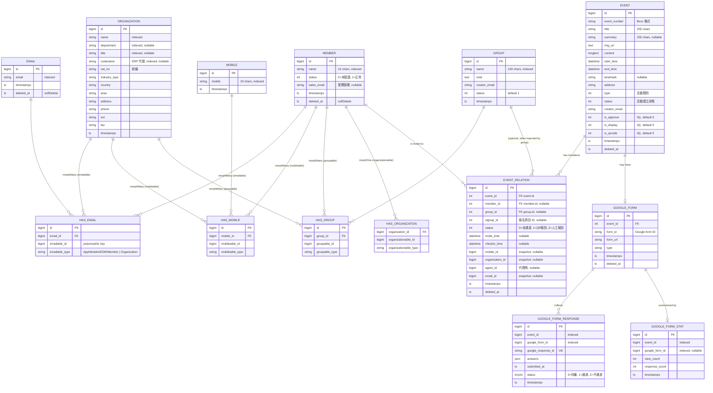

# Data Model

本文件描述 EDM Backend 在 MySQL 中的資料結構。目標讀者:**開發者、DBA、想理解持久化設計的 Reviewer**。

> 跟 [`architecture.md` Level 4](./architecture.md#level-4--class-diagram核心-domain-model-關聯) 的 Class Diagram 互補:Class Diagram 從 OOP 視角描述關聯,本文件從 DB schema 視角描述「資料怎麼落地」。

---

## 1. 資料表分類

| 分類 | 表 | 用途 |
|---|---|---|
| **EDM 核心** | `member` | 會員主檔 |
|  | `email` | Email(可被 member / organization 共用) |
|  | `mobile` | 手機(可被 member / organization 共用) |
|  | `organization` | 組織 / 公司 |
|  | `group` | 名單群組(可裝 member 或 organization) |
|  | `event` | 活動主檔 |
|  | `event_relation` | 活動 ↔ 邀請對象 (含邀請與報到 snapshot) |
|  | `event_template` | 活動模板 |
|  | `document_count` | 流水號計數器 (活動單號用) |
| **Polymorphic 中介** | `has_group` | Group 多型成員 (member / organization) |
|  | `has_organization` | Organization 多型擁有者 |
|  | `has_email` | Email 多型擁有者 |
|  | `has_mobile` | Mobile 多型擁有者 |
| **Google 整合** | `google_form` | Event 綁定的 Google 問卷 |
|  | `google_form_responses` | 問卷回應 + 審核 status |
|  | `google_form_stats` | 問卷檢視 / 回應統計 |
| **Laravel 系統** | `users` / `password_reset_tokens` / `sessions` | Laravel 預設(本系統 API only,**未實際使用**) |
|  | `cache` / `cache_locks` | `CACHE_STORE=database` 用 |
|  | `jobs` / `job_batches` / `failed_jobs` | `QUEUE_CONNECTION=database` 用 |
|  | `telescope_*` | Laravel Telescope debug 紀錄 |

---

## 2. ERD — EDM 核心



---

## 3. 核心設計模式

### 3.1 Polymorphic 關聯(`has_*` 中介表)

Email / Mobile / Group / Organization **不直接綁 member**,而是用 polymorphic 關聯,讓**未來可以掛在不同 owner 上**(member / organization / 甚至 group)。

```sql
CREATE TABLE has_email (
    id              BIGINT       PRIMARY KEY AUTO_INCREMENT,
    email_id        BIGINT UNSIGNED NOT NULL,
    emailable_id    BIGINT UNSIGNED NOT NULL,
    emailable_type  VARCHAR(255) NOT NULL  -- 'App\Models\EDM\Member' | 'App\Models\EDM\Organization'
);
```

**設計考量**

| 優點 | 缺點 |
|---|---|
| 加新的「可擁有 email 的 entity」不用改 schema | 不能直接用 SQL FK 約束(`emailable_id` 沒有單一目標) |
| Eloquent `morphMany` / `morphTo` 寫法統一 | 跨型別 join 比較繞,`WHERE emailable_type='...'` 必要 |
| 共用 email 紀錄(同一 email 可被多個 owner 引用) | 刪除 owner 時要手動清 `has_email`(無 cascade FK) |

> **Trade-off**:目前實際只有 `Member` 與 `Organization` 兩種 owner,看起來像「過度工程」。但保留這層抽象的成本不高(多一張中介表),拆掉的成本高(改 model 關聯、改 query),所以選擇保留。

### 3.2 EventRelation 為「邀請快照」

`event_relation` 不只是 event ↔ member 的關聯,**它把邀請當下的所有上下文凍結**:

| 欄位 | 為什麼凍結 |
|---|---|
| `email_id` / `mobile_id` | Member 可能有多個 email,邀請時用哪個要記住 |
| `organization_id` | Member 後來換公司,不影響歷史邀請紀錄 |
| `signup_id` | 對應的 Google Form 回應 |
| `invite_time` / `checkin_time` | 完整時間軸 |
| `status` | 報到方式(QR / 人工)也是稽核重點 |

> **設計原則**:**event_relation 一旦寫入,業務上不應該被覆蓋**(只能新增 / soft delete + 重建)。這個設計支援「歷史報表精準對齊當時情境」這個需求。

### 3.3 Soft Delete 預設開啟

業務 entity (`event` / `event_relation` / `member` / `email` / `google_form`) 都有 `deleted_at`。

對應 [adr/0003-soft-deletes.md](./adr/0003-soft-deletes.md)。簡述:

- ✅ 誤刪可救(行銷常常手滑)
- ✅ 稽核可追(誰在何時刪了哪場活動)
- ⚠ Query 必須帶 `whereNull('deleted_at')`,Eloquent `SoftDeletes` trait 自動處理

### 3.4 `document_count` 流水號

```sql
CREATE TABLE document_count (
    id     BIGINT PRIMARY KEY AUTO_INCREMENT,
    event  BIGINT DEFAULT 0  COMMENT '活動單號計數器'
);
```

集中式編號產生,避免 race condition(用 `UPDATE document_count SET event = event + 1` 取得新編號)。Event 編號格式 `B<seq>`,生成在 `EventController::create`。

---

## 4. 主要 Index 與查詢規劃

| 主要查詢 | 命中索引 | 出處 |
|---|---|---|
| 用 name 模糊搜 member | `member.idx_name` | `MemberController@list` |
| 用 name 模糊搜 organization | `organization.idx_name` | `OrganizationRepository` |
| 用 codename 找 organization (ERP 整合) | `organization.idx_codename` | `OrganizationRepository@findByCodename` |
| 列某 event 的所有邀請 | `event_relation` (建議補 `event_id` 索引) | `EventController@getInviteList` |
| Google Form Response 防重複入庫 | `google_form_responses.uniq_google_response_id` | `SyncGoogleForms` 排程 |

> **建議補的索引**(目前 schema 還沒加):
> - `event_relation (event_id)` — 列邀請名單必走
> - `event_relation (member_id, event_id)` — 查某 member 參與過的 event

---

## 5. 機敏資料考量

| 欄位 | 機敏性 | 處理 |
|---|---|---|
| `email.email` | 中(PII) | 索引以 hash 過比較不易,但目前明文。考慮 GDPR 場景時加密 / hash |
| `mobile.mobile` | 中(PII) | 同上 |
| `member.sales_email` | 中(內部資料) | 員工 email,內部使用 |
| `organization.vat_no` | 中(商業資料) | 統編,僅內部稽核 |
| `event_relation.checkin_time` + `invite_time` | 低(行為資料) | 稽核紀錄 |

> 本系統面向 **B2B 內部行銷活動**,不對 End User 開放。PII 處理目前以「不洩漏給外部」為原則,加密 / 雜湊機制屬於 Roadmap。

---

## 6. Migration 一覽

依時間順序(來源 [`database/migrations/`](../database/migrations/)):

| 日期 | Migration | 說明 |
|---|---|---|
| 2026-03-24 | `create_group_table` | + `has_group` 多型 pivot |
| 2026-03-24 | `create_event_table` | Event 主檔 |
| 2026-03-24 | `create_event_relation_table` | 邀請關聯 + snapshot |
| 2026-03-24 | `create_event_template_table` | 活動模板(目前無對應 controller) |
| 2026-03-24 | `create_member_table` | Member 主檔 |
| 2026-03-24 | `create_organization_table` | + `has_organization` 多型 |
| 2026-03-24 | `create_emails_table` | 注意 table 名稱是 `email`(單數) |
| 2026-03-24 | `create_mobile_table` | + `has_mobile` 多型 |
| 2026-03-26 | `create_telescope_entries_table` | Laravel Telescope |
| 2026-04-02 | `create_document_count_table` | 流水號 |
| 2026-04-07 | `create_google_form_table` | Google Form 綁定 |
| 2026-04-13 | `create_google_form_responses_table` | 回應主表 |
| 2026-04-13 | `create_google_form_stats_table` | 統計表 |
| 2026-04-13 | `add_status_to_google_form_responses_table` | 補 status 審核欄位 |

---

## 7. 資料保留與清理(Roadmap)

目前**沒有**自動清理機制。Soft delete 紀錄會永久保留。

**建議排程**(視場景):

| 表 | 保留期 | 清理方式 |
|---|---|---|
| `failed_jobs` | 30 天 | `php artisan queue:flush` |
| `telescope_entries` | 7 天 | `php artisan telescope:prune --hours=168`(已內建) |
| `jobs` (已完成) | 隨時 | Worker 完成後自動刪 |
| Soft-deleted entity | 永久(稽核需要) | 不清,但加歸檔表 |
