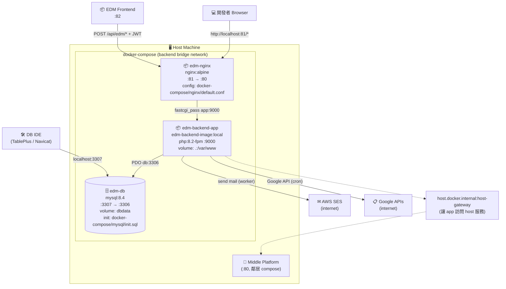
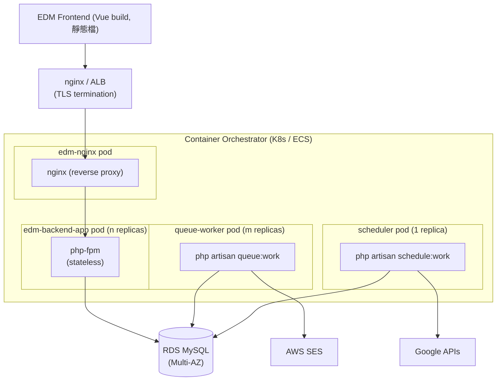

# Deployment View

本文件描述 EDM Backend 的**部署單元**(三個 container)、它們之間的網路關係,以及如何在本機與類正式環境啟動。

目標讀者:**Ops、Architect、想理解「跑起來長什麼樣」的 Reviewer**。

---

## 1. Deployment Diagram

### 1.1 開發環境(本機 Docker Compose)



### 1.2 假設的 Production Topology



> 此圖是**設計意圖**,實際 prod yaml 未提供。重點:
> - **Worker 拆獨立 pod**(可獨立擴展寄信吞吐)
> - **Scheduler 只跑 1 replica**(避免重複觸發)
> - **MySQL 完全離開 K8s,用 RDS**(資料持久化交給 managed service)

---

## 2. 容器規格

### 2.1 `edm-backend-app`

| 項目 | 值 | 出處 |
|---|---|---|
| Base image | `php:8.2-fpm` | [`Dockerfile`](../Dockerfile) |
| PHP 擴充 | `pdo_mysql`、`mbstring`、`zip`、`exif`、`pcntl`、`gd` | Dockerfile |
| 系統依賴 | `git`、`curl`、`zip`、`unzip`、`netcat-openbsd` | Dockerfile |
| Composer | 從官方 `composer:latest` image COPY 進來 | Dockerfile |
| Entry | `entrypoint.sh`(產生 `.env` → composer install → wait db → migrate → 啟動 fpm) | `entrypoint.sh` |
| 對外 port | — (內部 9000,nginx 透過 fastcgi_pass 轉接) | docker-compose |
| Volume(dev) | `.:/var/www` (bind mount,熱更新) | `docker-compose.local.yml` |
| Restart policy | `unless-stopped` | docker-compose |

### 2.2 `edm-nginx`

| 項目 | 值 |
|---|---|
| Image | `nginx:alpine` |
| 對外 port | **81** → 80 |
| Config | `docker-compose/nginx/default.conf`(dev)/ `prod.conf`(prod) |
| Volume | `.:/var/www`(讀取 Laravel public/) |

### 2.3 `edm-db`

| 項目 | 值 |
|---|---|
| Image | `mysql:8.4` |
| 對外 port | **3307** → 3306 (僅 dev,正式環境關閉) |
| Volume | `dbdata` (named) — DB 資料持久化 |
| Init script | `docker-compose/mysql/init.sql`(建立 `edm_db` 與 `developer` 帳號) |
| Root password | env var `MYSQL_ROOT_PASSWORD` |

> ⚠ Bind 對外 3307 方便本機 DBeaver / TablePlus 連入,**正式環境必須移除**。

---

## 3. 環境變數

完整模板見 [`.env.example`](../.env.example)。**關鍵變數**:

| 變數 | 說明 | 預設(dev) |
|---|---|---|
| `APP_URL` | 應用程式網址 | `http://localhost:81` |
| `APP_KEY` | Laravel 主密鑰,**亦是 JWT HS256 密鑰** | `php artisan key:generate` 產生 |
| `APP_ENV` | 環境 | `local` |
| `APP_DEBUG` | Debug mode | `true`(dev) |
| `LOG_LEVEL` | Log 等級 | `debug` |
| `DB_HOST` | MySQL host(Docker service name) | `db` |
| `DB_PORT` | MySQL port(容器內固定 3306) | `3306` |
| `DB_DATABASE` | DB 名稱 | `edm_db` |
| `DB_USERNAME` / `DB_PASSWORD` | DB 帳密(由 `init.sql` 建立) | `developer` / — |
| `QUEUE_CONNECTION` | Queue driver | `database` |
| `CACHE_STORE` | Cache driver | `database` |
| `HWS_VERIFY_URL` | 中台 SSO verify endpoint(備援用) | `http://host.docker.internal/api/edm/sso/verify-token` |
| `ALLOWED_EDM_IPS` | API 白名單 IP(逗號分隔,`*` 不限) | `*`(dev)|
| `EDM_FRONTEND_URL` | CORS 允許 origin | EDM 前端 URL |
| `AWS_ACCESS_KEY_ID` / `AWS_SECRET_ACCESS_KEY` / `AWS_DEFAULT_REGION` | AWS SES 寄信憑證 | — |
| `GOOGLE_*` | Google API 憑證(視具體變數而定) | — |

> **特別注意**:`APP_KEY` 同時用於 **Laravel encryption** 與 **JWT 驗證**,跟中台必須**完全一致**(包含 `base64:` 前綴)。詳見 [adr/0001-jwt-shared-secret.md](./adr/0001-jwt-shared-secret.md)。

---

## 4. 啟動 / 停止

### 4.1 本地開發

```bash
# 一次起完三個服務
docker compose -f docker-compose.yml -f docker-compose.local.yml up -d --build
```

啟動序(由 `entrypoint.sh` 主導):

1. 若無 `.env`,從預設模板產生
2. 修正 `storage` / `bootstrap/cache` / `vendor` 為 `www-data` 權限
3. `composer install`(安裝 vendor)
4. `nc -z db 3306` 輪詢直到 DB 可連線
5. `php artisan migrate --force`
6. 啟動 `php-fpm`

完成後可訪問:

| 服務 | 網址 |
|---|---|
| API Root | http://localhost:81 |
| Swagger UI (Scramble) | http://localhost:81/docs/api |
| Health Check | http://localhost:81/up |
| Telescope(僅 dev) | http://localhost:81/telescope |
| MySQL (DB IDE) | `localhost:3307` / 帳號 `developer` |

### 4.2 生產環境

```bash
docker compose -f docker-compose.yml -f docker-compose.prod.yml up -d --build
```

差異:
- Nginx 用 `prod.conf`,host 對外 `:80`
- MySQL **不對外** expose port
- `APP_ENV=production` / `APP_DEBUG=false` / `restart: always`

### 4.3 停止 / 清除

```bash
# 停止(保留容器與資料)
docker compose -f docker-compose.yml -f docker-compose.local.yml stop

# 移除容器(保留 DB volume)
docker compose -f docker-compose.yml -f docker-compose.local.yml down

# 完全清除(含 DB 資料,⚠ 不可逆)
docker compose -f docker-compose.yml -f docker-compose.local.yml down -v
```

---

## 5. Background Services

EDM Backend 有兩種背景任務,**目前 compose 預設沒有起**,需手動啟動:

### 5.1 Queue Worker(寄信用)

```bash
# 一次性啟動(前景,看 log)
docker exec -it edm-backend-app php artisan queue:work --tries=3 --timeout=60

# 背景常駐(實務上應該另開一個 service)
docker exec -d edm-backend-app php artisan queue:work --tries=3 --timeout=60
```

> **建議改善**:在 docker-compose.yml 加一個 `worker` service 共用 `edm-backend-image`:
> ```yaml
> worker:
>   image: edm-backend-image:local
>   command: php artisan queue:work --tries=3 --timeout=60
>   depends_on: [db, app]
>   networks: [backend]
> ```

### 5.2 Scheduler(Google Form 同步)

```bash
# Laravel 12 推薦 schedule:work(常駐,自己處理 minute-level dispatch)
docker exec -d edm-backend-app php artisan schedule:work

# 或傳統 cron + schedule:run
* * * * * docker exec edm-backend-app php artisan schedule:run >> /dev/null 2>&1
```

排程任務見 [`routes/console.php`](../routes/console.php),目前只有 `app:sync-google-forms` 每小時跑一次。

---

## 6. 健康檢查

| 檢查 | 方式 | 預期回應 |
|---|---|---|
| Web 是否就緒 | `curl http://localhost:81/up` | HTTP 200(Laravel 內建) |
| DB 是否就緒 | `docker exec edm-db mysqladmin ping -uroot -p<root>` | `mysqld is alive` |
| Queue 是否在跑 | `docker exec edm-backend-app php artisan queue:monitor default --max=100` | (列出狀態) |

---

## 7. 觀測性

| 工具 | 路徑 | 用途 |
|---|---|---|
| **Laravel Telescope** | http://localhost:81/telescope | 請求 / Query / Job / Exception 全紀錄(僅 dev) |
| **Laravel Pail** | `docker exec -it edm-backend-app php artisan pail` | Terminal 即時串流 log |
| **failed_jobs 表** | `php artisan queue:failed` | 失敗 Job 一覽,可 retry |
| **Container log** | `docker logs -f edm-backend-app` | nginx / php-fpm 標準輸出 |

> Telescope 在 prod 應**關掉或限制 IP**(不然會洩漏 request body)。

---

## 8. 常用維運指令

```bash
# 進容器
docker exec -it edm-backend-app bash

# Artisan
docker exec edm-backend-app php artisan route:list
docker exec edm-backend-app php artisan migrate
docker exec edm-backend-app php artisan migrate:fresh --seed
docker exec edm-backend-app php artisan tinker
docker exec edm-backend-app php artisan queue:work
docker exec edm-backend-app php artisan queue:retry all
docker exec edm-backend-app php artisan telescope:prune --hours=48

# 清除 cache
docker exec edm-backend-app php artisan optimize:clear

# 進 MySQL CLI
docker exec -it edm-db mysql -udeveloper -p edm_db
```

---

## 9. 已知部署限制

| 限制 | 影響 | 緩解 |
|---|---|---|
| Worker 未在 compose 預設 | 寄信不會自動跑 | 加 `worker` service(見 5.1) |
| Scheduler 未在 compose 預設 | Google Form 同步不會自動跑 | 加 `scheduler` service 或 host crontab |
| MySQL 對外 expose 3307 | 攻擊面 | prod compose 已移除 |
| `vendor/` 走 bind mount | 容器重建慢、跨平台路徑問題 | prod 用 `COPY` 進 image |
| `.env` 由 `entrypoint.sh` 預設產生 | 部署時容易忘改 `APP_KEY` | CI 階段強制檢查 `APP_KEY` 不是預設值 |
| JWT middleware 預設關 | API 開放給未授權 | prod 必開,加 CI 檢查 routes 檔案 |
| Telescope 預設啟用 | prod 洩漏敏感資料 | 用 `TELESCOPE_ENABLED=false` 關掉,或限 IP |
