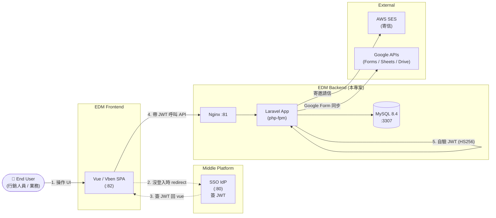

# Project Overview

本文件回答最根本的問題:**EDM Backend 是做什麼的?它在整個生態裡扮演什麼角色?**

---

## 1. 系統定位 — 一句話

> **EDM Backend 是「電子郵件行銷活動」的業務 API + 資料持久化層**,專門服務 EDM 前端 (Vue / Vben) 的請求,並透過 AWS SES 對 member 寄送活動邀請信。

它**不**做的事:不負責使用者登入、不渲染 UI、不直接被 End User 訪問。所有對外請求都需要先通過中台簽發的 JWT 驗證。

---

## 2. 在生態裡的位置



**關鍵設計**:EDM Backend 與中台**共享 `APP_KEY` (HS256 對稱密鑰)**,本地用 Firebase JWT 套件自行驗證,不必每次回中台 query。中台只在「簽發」時介入,「驗證」是分散式的。詳見 [adr/0001-jwt-shared-secret.md](./adr/0001-jwt-shared-secret.md)。

---

## 3. 核心業務概念

| 業務名詞 | 對應 Model | 說明 |
|---|---|---|
| **活動 (Event)** | `EDM\Event` | 一場行銷活動,有編號 / 標題 / 時間 / 地點 / 圖片 / 是否上架 / 是否需審核 / 是否產生 QRCode |
| **會員 (Member)** | `EDM\Member` | 收信對象。一個 Member 可有多個 Email 與多支手機 |
| **群組 (Group)** | `EDM\Group` | 會員集合,方便批次匯入活動邀請名單 |
| **邀請關聯 (EventRelation)** | `EDM\EventRelation` | Event ↔ Member 的關聯表(誰被邀請了哪場活動) |
| **問卷 (GoogleForm)** | `Google\GoogleForm` | 綁在 Event 上的 Google Form,用於收集報名/回饋 |
| **問卷回應 (GoogleFormResponse)** | `Google\GoogleFormResponse` | 使用者填寫的回應,有 status 欄位代表審核狀態 |
| **組織 (Organization)** | `EDM\Organization` | Member 所屬的公司/組織 |

業務流程的核心:
```
建立 Event → 從 Group 匯入 Member 到 EventRelation
           → 為 Event 建立 Google Form (報名表單)
           → 觸發 inviteMail → 對 EventRelation 中的 Member chunk 寄信 (走 AWS SES Job 隊列)
           → Scheduled command 每小時拉 Google Form 回應同步進 DB
           → 行銷人員在前端審核回應 (updateResponseStatus)
```

---

## 4. Scope — 做什麼,不做什麼

### ✅ In Scope

- **業務 CRUD API**:Member / Group / Event / EventRelation 的列表 / 詳細 / 建立 / 更新 / 狀態變更
- **活動圖片管理**:`imageUpload` / `getImage`
- **邀請信寄送**:`inviteMail` 透過 Queue + AWS SES 批次寄發
- **Google Form 整合**:建立 / 更新 / 刪除問卷,定時同步回應與統計
- **JWT 驗證**:接受中台簽發的 access token,以 `APP_KEY` 自驗
- **IP 白名單**:`WhitelistIpMiddleware` 提供額外網段控制(可開關)
- **API 文件**:Scramble 從 PHPDoc 自動產生 OpenAPI / Swagger UI

### ❌ Out of Scope

- **使用者登入 / 註冊**:由 [Middle Platform](../../Middle_Platform) 負責,本系統只**驗證**JWT,不**簽發**
- **權限管理 (RBAC)**:目前所有通過 JWT 的請求權限相同;細粒度 RBAC 屬於 Roadmap
- **前端渲染**:純 API,不回 HTML(`/up`、`/telescope`、Swagger UI 為例外)
- **Member 自助註冊**:Member 由行銷人員透過 `/api/edm/member/add` 建立,無對外註冊頁
- **多租戶 (Multi-tenant)**:單一組織模型;若要 SaaS 化需重新設計 schema

> **這條 Scope 線**確保本系統責任清楚:登入交給中台、UI 交給前端、寄信外包給 SES、表單外包給 Google,EDM Backend 專注於「行銷活動的業務邏輯」這一塊。

---

## 5. Stakeholders

| Stakeholder | 訴求 | 本系統如何回應 |
|---|---|---|
| **行銷人員 (End User)** | 透過前端管活動、寄信、看報名狀況 | 提供完整 CRUD API + 寄信入口 |
| **EDM 前端開發者** | 要清楚的 API 契約 | Scramble 自動產生 Swagger UI;統一 POST + JSON body |
| **中台 (IdP)** | 業務系統能正確驗 JWT | 共用 `APP_KEY`,本地驗證,不增加中台流量 |
| **Ops** | 部署單元清楚,可觀測 | Docker Compose 三服務分離 (nginx / app / db);Telescope 可看請求/Job/Query |
| **資安 / 稽核** | API 不被亂用 | JWT + IP 白名單 雙層保護(目前 JWT 在 dev 環境暫被註解,正式必開) |
| **AWS / Google 帳單擁有者** | 寄信與 API 用量可控 | inviteMail 走 chunk + queue;Google sync 走排程不主動拉 |

---

## 6. 設計原則

1. **Stateless API + 分散式驗證** — JWT 用 HS256 共享密鑰本地驗,不黏中台,可水平擴展
2. **重副作用走 Queue** — 寄信(對外 IO + 失敗重試)、Google sync(慢且額度有限)都離開請求路徑,放進 background job
3. **POST + JSON only** — 對齊前端習慣與 Scramble 預設;不混用 RESTful 動詞,避免每個 endpoint 要爭論「該用哪個 verb」
4. **Soft Delete 預設開** — 所有業務 entity 都有 `deleted_at`,誤刪可救、稽核可追(對應 [adr/0003-soft-deletes.md](./adr/0003-soft-deletes.md))
5. **Boring tech, Laravel default** — 不引 Redis / Octane / 自訂 ORM,完全用 Laravel 內建(database queue / database cache),降低部署門檻

---

## 7. 非功能需求 (Non-Functional Requirements)

> 本專案為作品集 / Portfolio 性質,以下 NFR 是「設計時有考量」而非「壓測通過」的承諾。

| 類別 | 目標 | 設計回應 |
|---|---|---|
| **可用性** | 中台短暫不可用時,**已驗 JWT 不受影響** | JWT 本地自驗,不依賴中台線上 |
| **安全性** | API 不能被未授權呼叫 | `AuthorizeJwt` + `WhitelistIpMiddleware` 雙層;敏感欄位走 `Hidden` |
| **可觀測性** | 出事能追到請求 / Query / Job | Laravel Telescope 全紀錄 (`/telescope`) |
| **可演進** | 寄信 / 表單服務可換 | `AwsSesService` / `GoogleApiService` 為獨立 service class,可換 SDK 不影響 controller |
| **Async 處理** | 寄大量信不阻塞 API | `SendAwsMailJob` chunk-based,走 database queue |

---

## 8. Glossary

| 術語 | 中文 | 說明 |
|---|---|---|
| **JWT** (JSON Web Token) | — | 由中台簽發,本系統驗證 |
| **HS256** | — | JWT 對稱簽章演算法,本系統與中台共享 `APP_KEY` |
| **SES** (Simple Email Service) | AWS 寄信服務 | 邀請信透過 SES 出去 |
| **Scramble** | — | Laravel 的 OpenAPI 自動產生器(類似 Swagger PHP) |
| **Telescope** | — | Laravel 官方 debug / monitoring 面板 |
| **Eloquent** | — | Laravel 的 ORM |
| **Queue Worker** | — | 跑背景 Job 的 process,本專案用 `database` driver |
| **Soft Delete** | 軟刪除 | 加 `deleted_at` 欄位代替真正 DELETE,可恢復 |
| **ADR** (Architecture Decision Record) | 架構決策紀錄 | 一份決策一份檔,寫「為何選 A 不選 B」 |
