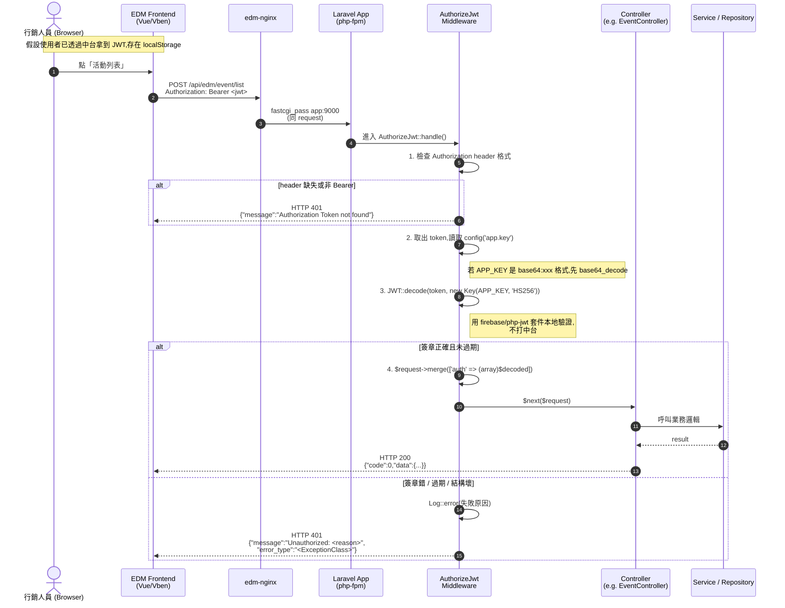
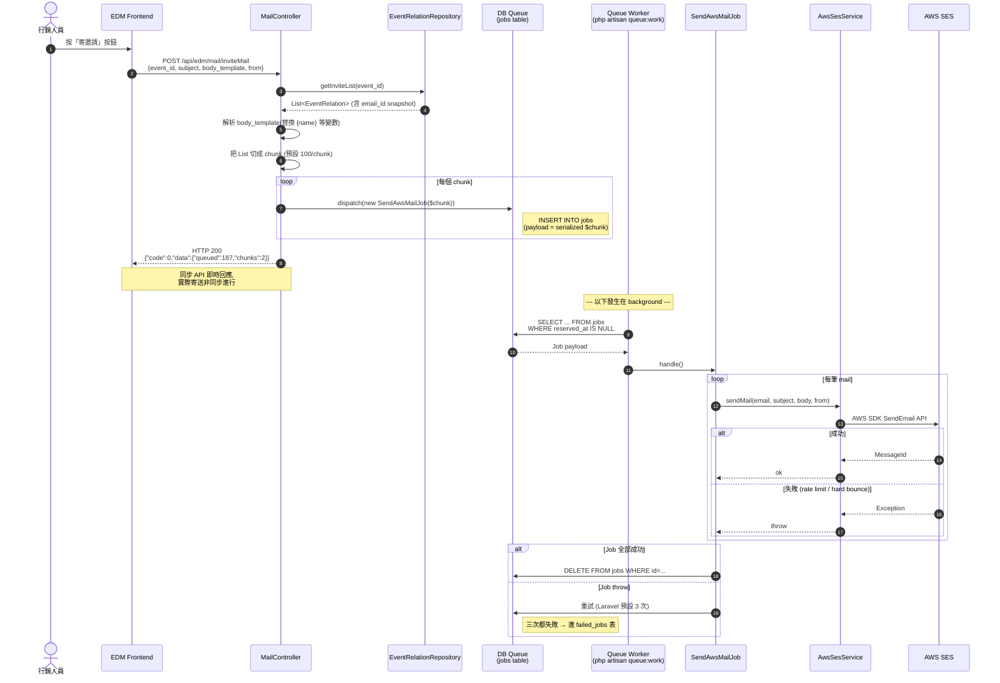
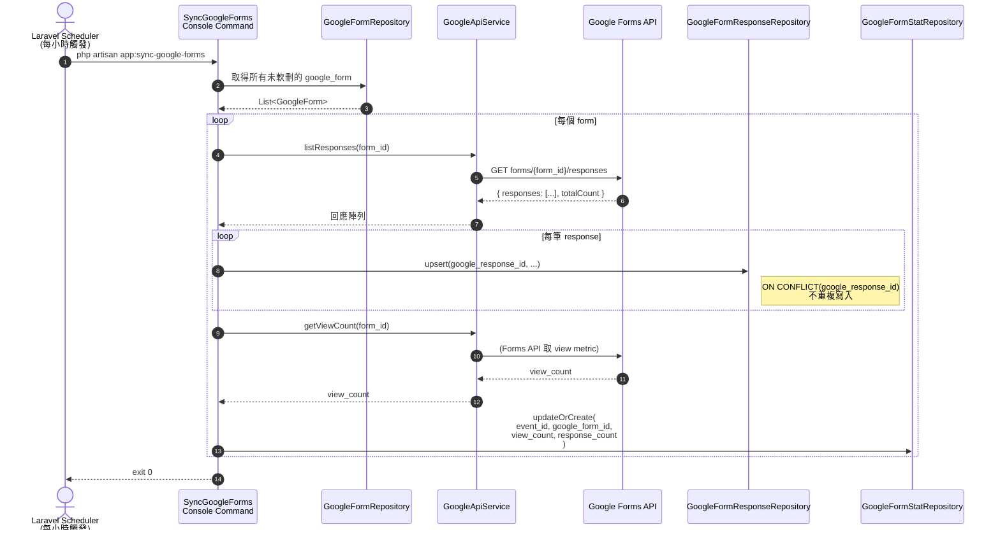
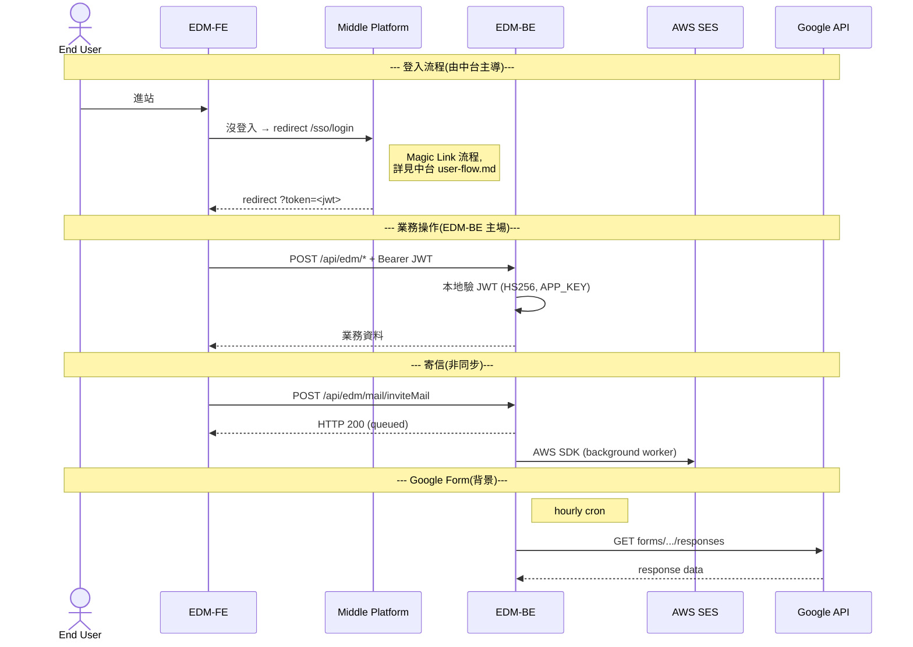

# Sequence Diagrams

本文件用 UML Sequence Diagram 描述 EDM Backend 的關鍵互動流程。目標讀者:**SA、開發者、想理解跨系統時序的 Reviewer**。

涵蓋三個流程:

1. JWT 驗證 — 收到請求到通過 middleware 的時序
2. 寄送活動邀請信 — 從 controller 到 AWS SES 的非同步流程
3. Google Form 回應同步 — 排程 cron 拉資料的流程

---

## 1. JWT 驗證流程

「前端帶 JWT 來,EDM Backend 怎麼確認這個 token 是真的、是誰?」



**關鍵設計**

| 步驟 | 設計考量 |
|---|---|
| 3 — 本地驗證 | 不打中台 → 中台短暫不可用,EDM Backend 仍能服務已登入使用者 |
| 4 — `auth` 注入 request | Controller 可以 `$request->input('auth.email')` 取使用者身分,不需要再解一次 token |
| 失敗 log | 帶 `token_sample`(前 15 字)與 `secret_length`,協助偵測「key 不對齊」這種典型部署錯誤 |

**對比中台的 verify 方式**(若改走中台 verify):

| 方式 | 優點 | 缺點 |
|---|---|---|
| **本地驗 (現選)** | 中台離線不影響、效能好、無網路成本 | 需共用 SECRET_KEY,洩漏風險集中 |
| **回中台 verify** | EDM Backend 不持有 secret,中台可立即撤銷 | 中台變單點,每個 request 加 RTT |

詳見 [adr/0001-jwt-shared-secret.md](./adr/0001-jwt-shared-secret.md) 的取捨討論。

---

## 2. 寄送活動邀請信

「行銷人員按下『寄邀請』,系統如何把信送出去?」



**設計重點**

- **同步 API 立即回 200**:User 不用等寄信完成,UX 即時
- **Chunk 100 筆**:平衡 SES API rate limit 與 Job 顆粒度(太大難重試,太小 queue 開銷大)
- **Email_id snapshot**:寄信用的 email 從 `event_relation.email_id` 取,**不是即時查 member 的 primary email**(因為邀請當下凍結了)
- **失敗進 `failed_jobs`**:可手動 `php artisan queue:retry all` 補寄

**Roadmap**

- 加 webhook 接 SES 的 bounce / complaint event,自動更新 `event_relation.status`
- 加 `inviteMail` rate limit,避免誤觸發大量寄信(對應 [api-spec.md 第 5 節](./api-spec.md#5-速率限制--rate-limiting))

---

## 3. Google Form 回應同步

「使用者填了 Google Form,系統怎麼把回應拉進 DB?」



**關鍵設計**

| 步驟 | 設計考量 |
|---|---|
| `google_response_id` 唯一索引 | 排程跑多次也不會重複寫入(冪等) |
| 排程 = hourly | 行銷活動報名不需要即時,1 hr 延遲可接受;避免 Google API 配額耗盡 |
| `status` 預設 0 (待審核) | 自動同步進來不直接列入名單,需行銷人員審核 |

**對應排程設定**(在 [`routes/console.php`](../routes/console.php)):

```php
Schedule::command('app:sync-google-forms')->hourly();
```

要在 host 啟動 scheduler:

```bash
docker exec edm-backend-app php artisan schedule:work
```

> 實際 production 通常用 cron + `php artisan schedule:run` 每分鐘執行。詳見 [`deployment.md`](./deployment.md) 的 Background services 章節。

---

## 4. 跨系統一覽(對應中台)

EDM Backend 與其他系統的所有互動點,整合 view:



完整的中台側流程見 [Middle Platform user-flow.md](../../Middle_Platform/docs/user-flow.md)。
